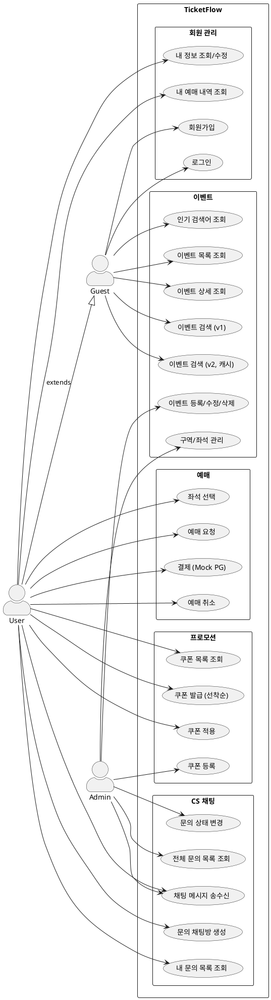

# 📐 유스케이스 명세서

## 1. 액터 정의

| 액터 | 설명 |
|------|------|
| **Guest** | 비로그인 사용자. 이벤트 조회·검색만 가능 |
| **User** | 로그인한 일반 회원. 예매·쿠폰·CS 문의 가능 |
| **Admin** | 관리자. 이벤트 등록, CS 처리, 전체 조회 권한 |

---

## 2. 유스케이스 다이어그램 (PlantUML)

---

## 3. 유스케이스 명세 (상세)

### UC21 — 예매 요청 ⭐ (동시성 제어 핵심)

| 항목 | 내용 |
|------|------|
| **유스케이스명** | 예매 요청 |
| **액터** | User |
| **사전 조건** | 로그인 상태, 좌석이 선택된 상태 |
| **사후 조건** | 예매 레코드 생성, 재고 1 차감, 결제 대기 상태 |
| **주 시나리오** | 1. 사용자가 좌석 선택 후 예매 요청   2. 서버가 Redis 분산락 획득 시도   3. 락 획득 성공 → 재고 확인   4. 재고 있음 → 좌석 임시 선점 (TTL 5분)   5. 예매 레코드 생성 (status: PENDING)   6. 락 해제   7. 결제 화면으로 이동 |
| **예외 시나리오** | 2a. 락 획득 실패 (재시도 3회 후) → 409 Conflict 반환   3a. 재고 없음 → 400 Bad Request "매진"   4a. 이미 본인이 선점한 좌석 → 400 Bad Request |
| **비고** | TTL 5분 내 결제 미완료 시 좌석 선점 자동 해제 및 재고 복구 |

---

### UC31 — 쿠폰 발급 (선착순) ⭐ (동시성 제어 핵심)

| 항목 | 내용 |
|------|------|
| **유스케이스명** | 선착순 쿠폰 발급 |
| **액터** | User |
| **사전 조건** | 로그인 상태, 해당 쿠폰 미발급 상태 |
| **사후 조건** | 쿠폰 발급 레코드 생성, 쿠폰 잔여 수량 1 차감 |
| **주 시나리오** | 1. 사용자가 쿠폰 발급 요청   2. 서버가 Redis 분산락 획득   3. 잔여 수량 확인 (> 0)   4. 발급 이력 중복 확인   5. 쿠폰 발급 레코드 생성   6. 잔여 수량 1 차감   7. 락 해제   8. 발급 완료 응답 |
| **예외 시나리오** | 3a. 잔여 수량 0 → 400 "소진"   4a. 이미 발급받은 사용자 → 400 "중복 발급 불가" |

---

### UC12/UC13 — 이벤트 검색 (v1/v2)

| 항목 | 내용 |
|------|------|
| **유스케이스명** | 이벤트 검색 |
| **액터** | Guest, User |
| **사전 조건** | 없음 |
| **주 시나리오 (v1)** | 1. 검색어·장르·날짜 조건 입력   2. DB LIKE 쿼리 실행   3. 페이징된 결과 반환   4. Redis ZSet에 검색어 점수 +1 (ZINCRBY) |
| **주 시나리오 (v2)** | 1. 검색어·조건 입력   2. Caffeine 캐시 키 확인 → HIT 시 즉시 반환   3. MISS 시 DB 조회 후 캐시 저장 (TTL 5분)   4. 결과 반환 |
| **비고** | 동일 조건 반복 조회 시 v2가 v1 대비 응답 시간 50%↓ 목표 |

---

### UC40~44 — CS 채팅

| UC | 유스케이스명 | 액터 | 핵심 로직 |
|----|------------|------|-----------|
| UC40 | 문의 채팅방 생성 | User | ChatRoom 생성, status=WAITING |
| UC41 | 채팅 메시지 송수신 | User, Admin | STOMP /pub/chat/{roomId}, JWT 인증 |
| UC42 | 내 문의 목록 조회 | User | 본인 ChatRoom만 조회 |
| UC43 | 전체 문의 목록 조회 | Admin | 전체 + 상태별 필터링 |
| UC44 | 문의 상태 변경 | Admin | WAITING→IN_PROGRESS→COMPLETED |

---

## 4. 권한 매트릭스

| 기능 | Guest | User | Admin |
|------|:-----:|:----:|:-----:|
| 이벤트 조회·검색 | ✅ | ✅ | ✅ |
| 회원가입·로그인 | ✅ | - | - |
| 예매 요청·취소 | ❌ | ✅ | ✅ |
| 쿠폰 발급·적용 | ❌ | ✅ | ✅ |
| CS 문의 생성 | ❌ | ✅ | ❌ |
| CS 문의 처리 | ❌ | ❌ | ✅ |
| 이벤트 등록·수정·삭제 | ❌ | ❌ | ✅ |
| 전체 문의 목록 조회 | ❌ | ❌ | ✅ |
| 문의 상태 변경 | ❌ | ❌ | ✅ |