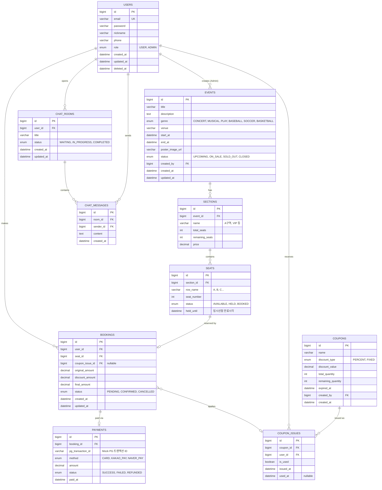

# 🗄️ ERD (Entity Relationship Diagram)

## 1. ERD 다이어그램



---

## 2. 테이블 설계 주요 결정 사항

### 2-1. SEATS.status 3단계 설계 이유

| 상태 | 의미 | 전환 조건 |
|------|------|-----------|
| `AVAILABLE` | 예매 가능 | 초기값, 취소/만료 시 복구 |
| `HELD` | 임시 선점 (5분) | 좌석 선택 시, TTL 만료 시 AVAILABLE로 복구 |
| `BOOKED` | 예매 확정 | 결제 완료 시 |

> HELD 상태를 별도로 두는 이유: 결제 페이지에서 이탈한 사용자의 좌석이 다른 사용자에게 즉시 노출되면 UX가 깨진다. 5분 유예를 통해 실제 구매율을 높이면서 영구 점유는 방지한다.

### 2-2. BOOKINGS.coupon_issue_id nullable 설계

쿠폰 없이도 예매 가능해야 하므로 FK를 nullable로 설계. `COUPON_ISSUES.is_used`로 쿠폰 사용 여부를 추적한다.

### 2-3. CHAT_MESSAGES → CHAT_ROOMS 단방향 참조

양방향 연관관계 설정 시 `@OneToMany` 로딩으로 모든 메시지를 채팅방 조회 시 함께 불러오는 문제 발생. 메시지는 항상 커서 기반 페이징으로 별도 조회하므로 단방향이 적합하다.

### 2-4. 인덱스 설계 포인트 (도전 기능 연계)

| 테이블 | 인덱스 대상 컬럼 | 이유 |
|--------|----------------|------|
| EVENTS | `(genre, start_at, status)` | 장르별 + 날짜 범위 검색 빈번 |
| EVENTS | `title` | LIKE 검색 대상 |
| SEATS | `(section_id, status)` | 구역별 잔여 좌석 조회 |
| BOOKINGS | `user_id` | 내 예매 내역 조회 |
| COUPON_ISSUES | `(coupon_id, user_id)` | 중복 발급 확인 (UK 제약도 고려) |
| CHAT_MESSAGES | `(room_id, id DESC)` | 커서 기반 최신 메시지 조회 |
| CHAT_ROOMS | `(user_id, status)` | 사용자별/상태별 문의 조회 |

---

## 3. 도메인 경계 정리

```
[User Domain]
  └─ USERS

[Event Domain]
  └─ EVENTS, SECTIONS, SEATS

[Booking Domain]
  └─ BOOKINGS, PAYMENTS

[Promotion Domain]
  └─ COUPONS, COUPON_ISSUES

[Chat Domain]
  └─ CHAT_ROOMS, CHAT_MESSAGES
```

각 도메인은 다른 도메인의 엔티티를 직접 참조하지 않고 **ID(FK)로만 참조**한다.
예: Booking 도메인에서 User 엔티티를 `@ManyToOne`으로 로딩하되, User 도메인 서비스를 직접 호출하지 않는다.