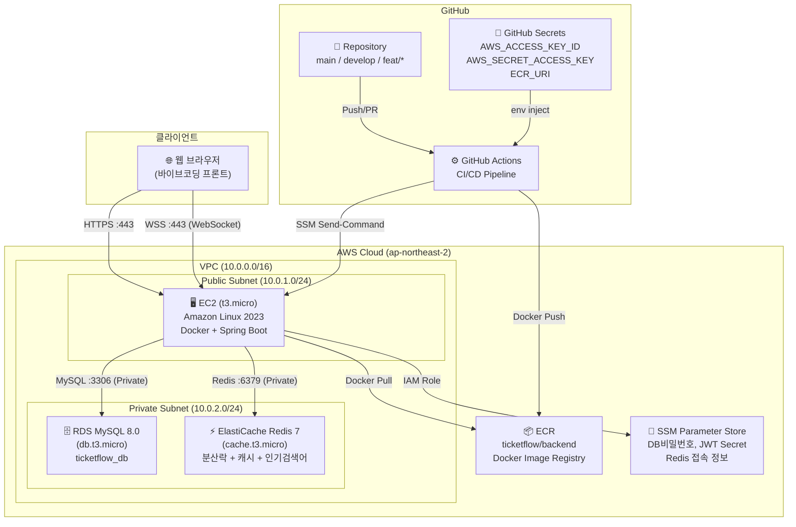
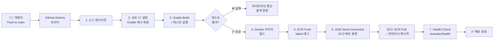
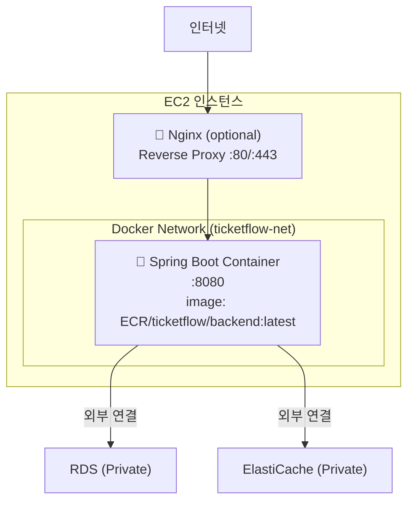
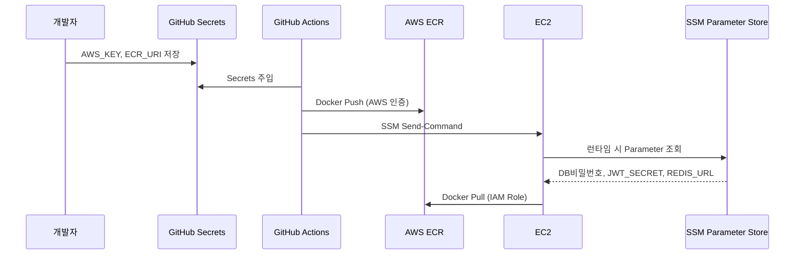

# 🏗️ 인프라 아키텍처 다이어그램

## 1. 전체 아키텍처



---

## 2. CI/CD 파이프라인 흐름



---

## 3. EC2 내부 Docker 구성



> **로컬 개발 환경** (docker-compose.yml)
> ```
> services:
>   app: Spring Boot (빌드된 jar)
>   mysql: MySQL 8.0
>   redis: Redis 7
> ```
> 로컬에서는 docker-compose로 MySQL + Redis를 함께 실행하므로 AWS 없이 개발 가능

---

## 4. 보안 그룹 설계

| 보안 그룹 | 인바운드 허용 | 설명 |
|-----------|-------------|------|
| sg-ec2 | 80, 443 (0.0.0.0/0) | 웹 트래픽 |
| sg-ec2 | 22 (개발자 IP만) | SSH (SSM 사용 시 불필요) |
| sg-rds | 3306 (sg-ec2만) | EC2에서만 MySQL 접근 |
| sg-redis | 6379 (sg-ec2만) | EC2에서만 Redis 접근 |

---

## 5. 민감 정보 관리 흐름



**Parameter Store 키 구조:**
```
/ticketflow/prod/db/password
/ticketflow/prod/db/url
/ticketflow/prod/jwt/secret
/ticketflow/prod/redis/url
```

---

## 6. 로컬 개발 환경 구성 (docker-compose.yml 예시)

```yaml
version: '3.8'

services:
  mysql:
    image: mysql:8.0
    environment:
      MYSQL_DATABASE: ticketflow_db
      MYSQL_ROOT_PASSWORD: local_password
    ports:
      - "3306:3306"
    volumes:
      - mysql_data:/var/lib/mysql

  redis:
    image: redis:7-alpine
    ports:
      - "6379:6379"
    command: redis-server --appendonly yes

volumes:
  mysql_data:
```

---

## 7. 배포 환경별 설정 분리

| 환경 | DB | Redis | 설정 파일 |
|------|----|----|-----------|
| local | Docker MySQL | Docker Redis | `application-local.yml` |
| prod | AWS RDS | AWS ElastiCache | `application-prod.yml` + SSM |

Spring Profile 활성화: `SPRING_PROFILES_ACTIVE=prod` (EC2 컨테이너 환경변수)