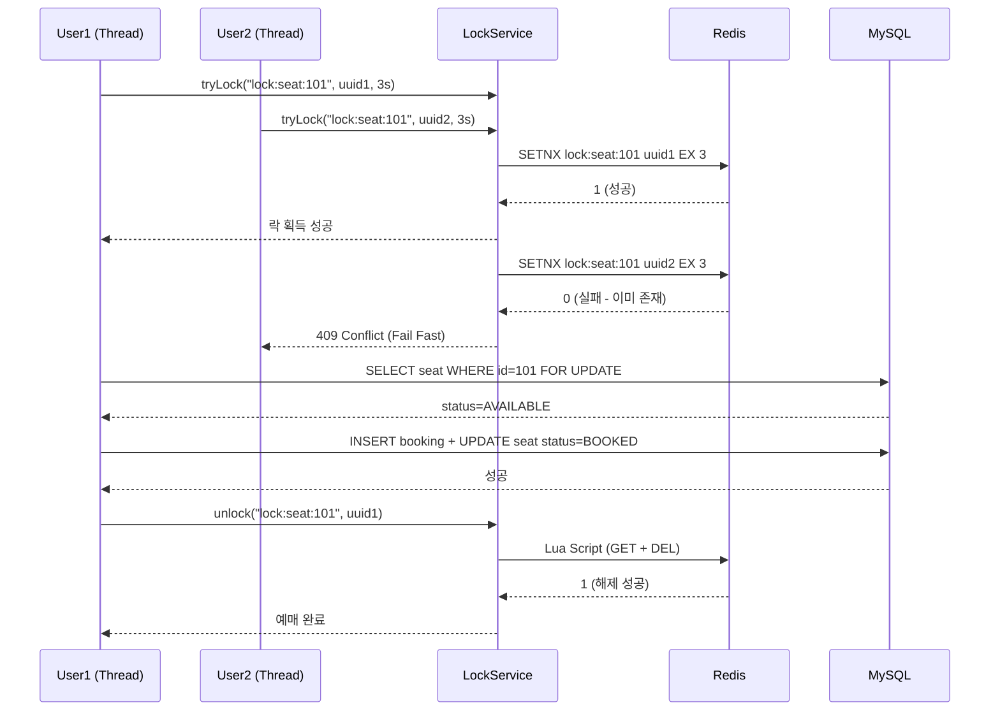
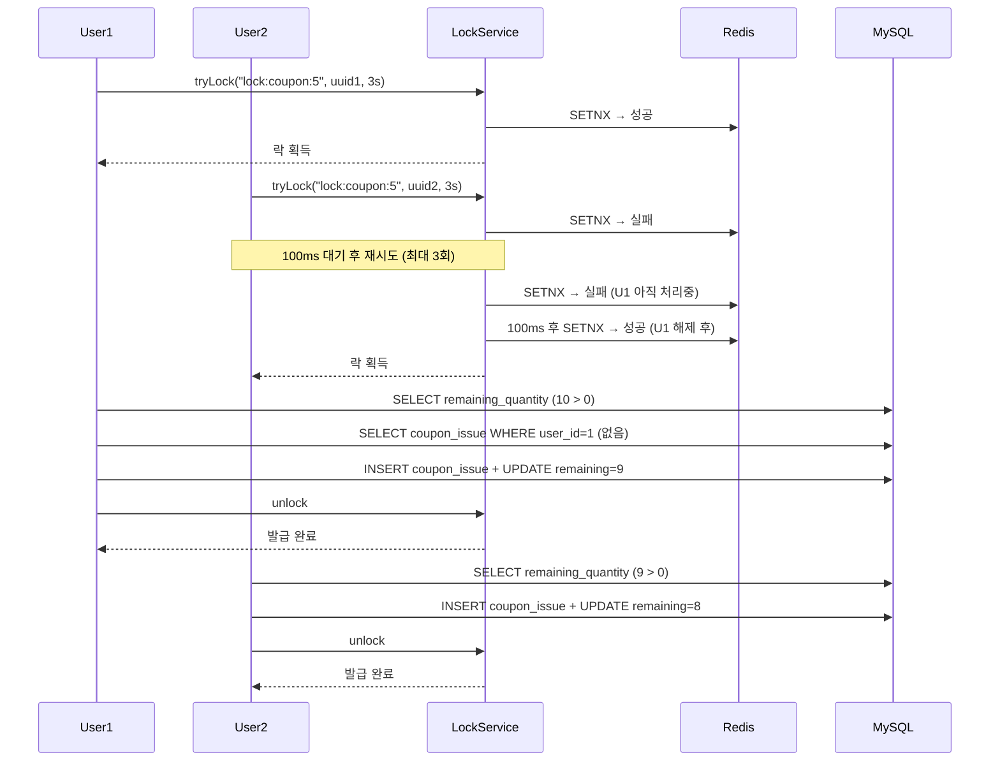

# ⚡ 동시성 제어 설계서

## 1. 문제 정의

티켓팅 서비스는 **오픈 순간 수천 명이 동시에 동일한 좌석·쿠폰에 접근**한다.
동시성 제어 없이는 다음 문제가 발생한다:

| 문제 | 설명 | 결과 |
|------|------|------|
| Race Condition | Thread A, B가 동시에 재고 1을 읽고 각각 차감 | 재고 -1 (음수 발생) |
| Lost Update | 두 트랜잭션이 동시에 UPDATE → 하나의 결과만 반영 | 중복 예매 발생 |
| Dirty Read | 미완료 트랜잭션의 데이터를 읽어 잘못된 처리 | 쿠폰 초과 발급 |

---

## 2. 제어 대상 시나리오 매트릭스

| # | 시나리오 | 동시 요청 규모 | 데이터 범위 | 채택 전략 | 이유 |
|---|----------|----------------|-------------|-----------|------|
| S1 | 티켓 예매 (좌석 선점) | 수천 명 | 좌석 단위 | Redis 분산락 (Lettuce) | 서버 다중화 대비, 비즈니스 로직 전체 보호 |
| S2 | 선착순 쿠폰 발급 | 수백 명 | 쿠폰 단위 | Redis 분산락 (Lettuce) | 발급 이력 확인 + 수량 차감 원자적 처리 |
| S3 | 결제 완료 처리 | 단일 요청 | 예매 단위 | DB 비관적 락 (JPA) | 단일 서버, DB 트랜잭션 범위 내 충분 |

> **왜 비관적 락/낙관적 락이 아닌 Redis 분산락을 S1·S2에 채택했는가?**
>
> | 방식 | 보호 범위 | 서버 다중화 | 성능 | S1/S2 적합성 |
> |------|-----------|-------------|------|--------------|
> | 낙관적 락 (`@Version`) | DB UPDATE 충돌 감지 | ✅ | ⭐⭐⭐ | ❌ 충돌 빈번 시 재시도 폭풍 |
> | 비관적 락 (SELECT FOR UPDATE) | DB 트랜잭션 범위 | ❌ (단일 DB 전제) | ⭐⭐ | ❌ 외부 API 호출 포함 불가 |
> | Redis 분산락 | 비즈니스 로직 전체 | ✅ | ⭐⭐ | ✅ Scale-out 대비, 로직 전체 보호 |

---

## 3. Redis 분산락 설계 (Lettuce, SETNX + TTL)

### 3-1. 핵심 구현 구조

```
LockRedisRepository          LockService              비즈니스 서비스
      │                           │                         │
      │ SETNX lock:key uuid       │                         │
      │ TTL 3초                   │                         │
      │◄──────────────────────────│ tryLock(key, uuid, ttl) │
      │                           │◄────────────────────────│ lock()
      │                           │                         │
      │                           │ 비즈니스 로직 실행       │
      │                           │────────────────────────►│
      │                           │                         │
      │ Lua Script: 본인 락만 해제│                         │
      │◄──────────────────────────│ unlock(key, uuid)       │
```

### 3-2. Lock Key 설계

| 시나리오 | Lock Key | 근거 |
|----------|----------|------|
| 티켓 예매 | `lock:seat:{seatId}` | 좌석 단위로 락 → 서로 다른 좌석은 병렬 처리 가능 |
| 쿠폰 발급 | `lock:coupon:{couponId}` | 쿠폰 단위로 락 → 쿠폰별 독립 처리 |

> **왜 `lock:booking:{userId}`가 아닌 `lock:seat:{seatId}`인가?**
> 사용자별 락은 한 사용자의 요청만 직렬화할 뿐, 동일 좌석에 대한 다른 사용자의 동시 접근을 막지 못한다. 보호 대상(좌석 재고)과 락 키를 일치시켜야 한다.

### 3-3. TTL 설계

```
Lock TTL = 3초 이유:
  - 비즈니스 로직 평균 처리 시간: ~100ms
  - 네트워크 지연 + DB 쿼리: ~200ms
  - 여유 시간: 2.7초
  - 3초 초과 = 서버 장애 간주 → 자동 해제로 데드락 방지
```

### 3-4. 재시도 전략 비교

| 시나리오 | 전략 | 설정 | 이유 |
|----------|------|------|------|
| 티켓 예매 (S1) | Fail Fast (즉시 실패) | 재시도 없음 | 오픈 순간 수천 명 → 대기열 없이 빠른 실패가 UX에 유리 |
| 쿠폰 발급 (S2) | Retry with backoff | 100ms 간격 × 3회 | 수십~수백 명 규모, 짧은 대기로 성공률 향상 |

### 3-5. Lua Script를 이용한 원자적 락 해제

```lua
-- 본인이 잡은 락만 해제 (UUID 검증)
if redis.call('get', KEYS[1]) == ARGV[1] then
    return redis.call('del', KEYS[1])
else
    return 0
end
```

> **왜 Lua Script를 사용하는가?**
> GET → DEL을 별도 명령으로 실행하면 GET 후 DEL 사이에 다른 스레드가 새 락을 획득할 수 있다 (TOCTOU 취약점). Lua Script는 Redis에서 원자적으로 실행되므로 이 문제를 방지한다.

---

## 4. 시나리오별 상세 플로우

### S1 — 티켓 예매 플로우



### S2 — 쿠폰 발급 플로우



---

## 5. 테스트 코드 설계

### 5-1. 동시성 이슈 검증 테스트 (실패해야 정상)

```java
@Test
@DisplayName("동시성 제어 없을 때 재고 초과 발생 검증")
void concurrency_without_lock_should_fail() throws Exception {
    // Given
    int threadCount = 100;
    int initialStock = 50; // 50장만 발급 가능
    ExecutorService executor = Executors.newFixedThreadPool(threadCount);
    CyclicBarrier barrier = new CyclicBarrier(threadCount);
    AtomicInteger successCount = new AtomicInteger(0);

    // When: 100명이 동시에 50장짜리 쿠폰 발급 시도
    for (int i = 0; i < threadCount; i++) {
        final long userId = i + 1;
        executor.submit(() -> {
            barrier.await(); // 모든 스레드 동시 출발
            try {
                couponService.issueCouponWithoutLock(couponId, userId);
                successCount.incrementAndGet();
            } catch (Exception e) { /* 무시 */ }
        });
    }
    executor.awaitTermination(10, TimeUnit.SECONDS);

    // Then: 락 없으면 50 초과 발급 → 테스트 실패 (재고 불일치 확인)
    Coupon coupon = couponRepository.findById(couponId).get();
    assertThat(coupon.getRemainingQuantity()).isGreaterThanOrEqualTo(0);
    // ⚠️ 이 테스트는 락 없을 때 재고가 음수가 되므로 실패해야 정상
}
```

### 5-2. Redis 락 적용 후 검증 (통과해야 정상)

```java
@Test
@DisplayName("Redis 분산락 적용 후 100명 동시 발급 시 정확히 50명만 성공")
void concurrency_with_redis_lock_should_pass() throws Exception {
    // Given
    int threadCount = 100;
    int couponStock = 50;
    // ...

    // When: 100명 동시 시도

    // Then
    assertThat(successCount.get()).isEqualTo(couponStock); // 정확히 50명만 성공
    Coupon coupon = couponRepository.findById(couponId).get();
    assertThat(coupon.getRemainingQuantity()).isEqualTo(0); // 재고 정확히 0
}
```

---

## 6. 도전 기능 — AOP 기반 락 적용

### 커스텀 어노테이션 설계

```java
@Target(ElementType.METHOD)
@Retention(RetentionPolicy.RUNTIME)
public @interface RedisLock {
    String key();           // SpEL: "seat:#seatId"
    long waitTime() default 0;
    long leaseTime() default 3;
    TimeUnit timeUnit() default TimeUnit.SECONDS;
    RetryStrategy retry() default RetryStrategy.FAIL_FAST;
}
```

### 적용 예시

```java
// Before (락 코드가 비즈니스 로직에 섞임)
public BookingResponse createBooking(Long seatId, Long userId) {
    String lockKey = "lock:seat:" + seatId;
    String uuid = UUID.randomUUID().toString();
    if (!lockService.tryLock(lockKey, uuid, 3)) {
        throw new LockAcquisitionException();
    }
    try {
        // 비즈니스 로직
    } finally {
        lockService.unlock(lockKey, uuid);
    }
}

// After (AOP로 분리)
@RedisLock(key = "seat:#seatId", retry = RetryStrategy.FAIL_FAST)
public BookingResponse createBooking(Long seatId, Long userId) {
    // 비즈니스 로직만 남음
}
```