# 📐 유스케이스 명세서

> **문서 버전:** v1.0
> **최종 수정일:** 2025-06-13
> **연관 문서:** 01_프로젝트_개요서_v3.md / 02_사용자_시나리오.md

---

## 1. 액터 정의

| 액터 | 설명 | 권한 범위 |
|------|------|-----------|
| `일반 회원` | 회원가입 후 로그인한 사용자 | 이벤트 조회·검색, 예매, 쿠폰 발급·사용, CS 문의 |
| `관리자` | TicketFlow 운영팀 계정 | 이벤트 등록·수정, 쿠폰 생성, CS 문의 처리 |
| `비회원` | 미로그인 사용자 | 이벤트 조회·검색만 가능 |
| `Mock PG` | 외부 결제 시스템 (시스템 액터) | 결제 처리 웹훅 전송 |

---

## 2. 유스케이스 목록

### 2-1. 회원 도메인

| UC ID | 유스케이스명 | 주 액터 | 우선순위 |
|-------|-------------|---------|---------|
| UC-01 | 회원가입 | 비회원 | 필수 |
| UC-02 | 로그인 | 비회원 | 필수 |
| UC-03 | 내 정보 조회 | 일반 회원 | 필수 |
| UC-04 | 내 정보 수정 | 일반 회원 | 필수 |
| UC-05 | 내 예매 내역 조회 | 일반 회원 | 필수 |

### 2-2. 이벤트 도메인

| UC ID | 유스케이스명 | 주 액터 | 우선순위 |
|-------|-------------|---------|---------|
| UC-06 | 이벤트 목록 조회 | 비회원, 일반 회원 | 필수 |
| UC-07 | 이벤트 상세 조회 | 비회원, 일반 회원 | 필수 |
| UC-08 | 이벤트 검색 v1 (캐시 미적용) | 비회원, 일반 회원 | 필수 |
| UC-09 | 이벤트 검색 v2 (Caffeine 캐시) | 비회원, 일반 회원 | 필수 |
| UC-10 | 인기 검색어 조회 | 비회원, 일반 회원 | 필수 |
| UC-11 | 이벤트 등록 | 관리자 | 필수 |
| UC-12 | 이벤트 수정 | 관리자 | 필수 |

### 2-3. 예매 도메인

| UC ID | 유스케이스명 | 주 액터 | 우선순위 |
|-------|-------------|---------|---------|
| UC-13 | 좌석 목록 조회 | 일반 회원 | 필수 |
| UC-14 | 좌석 임시 점유 (Hold) | 일반 회원 | 필수 |
| UC-15 | 좌석 Hold 해제 (직접 취소) | 일반 회원 | 필수 |
| UC-16 | 예매 결제 요청 | 일반 회원 | 필수 |
| UC-17 | 결제 완료 웹훅 수신 | Mock PG | 필수 |
| UC-18 | 예매 확정 처리 | Mock PG | 필수 |

### 2-4. 프로모션 도메인

| UC ID | 유스케이스명 | 주 액터 | 우선순위 |
|-------|-------------|---------|---------|
| UC-19 | 쿠폰 생성 | 관리자 | 필수 |
| UC-20 | 선착순 쿠폰 발급 | 일반 회원 | 필수 |
| UC-21 | 내 쿠폰 목록 조회 | 일반 회원 | 필수 |
| UC-22 | 예매 시 쿠폰 적용 | 일반 회원 | 필수 |

### 2-5. CS 채팅 도메인 (도전)

| UC ID | 유스케이스명 | 주 액터 | 우선순위 |
|-------|-------------|---------|---------|
| UC-23 | CS 문의 채팅방 개설 | 일반 회원 | 도전 |
| UC-24 | 채팅 메시지 전송 | 일반 회원, 관리자 | 도전 |
| UC-25 | CS 문의 목록 조회 | 관리자 | 도전 |
| UC-26 | CS 문의 상태 변경 | 관리자 | 도전 |
| UC-27 | 채팅 내역 조회 | 일반 회원, 관리자 | 도전 |

---

## 3. PlantUML 유스케이스 다이어그램

```plantuml
@startuml TicketFlow_UseCases

top to bottom direction
scale 0.9

skinparam actorStyle awesome
skinparam packageStyle rectangle
skinparam ArrowColor #555555
skinparam ActorBorderColor #333333
skinparam UsecaseBorderColor #336699
skinparam UsecaseBackgroundColor #EEF4FF
skinparam PackageBorderColor #AAAAAA
skinparam PackageBackgroundColor #FAFAFA
skinparam defaultFontSize 11

' ==================== 액터 ====================
actor "비회원" as Guest
actor "일반 회원" as User
actor "관리자" as Admin
actor "Mock PG" as PG

' 상속 관계
Guest <|-- User

' ==================== 회원 도메인 ====================
package "회원 도메인" {
  usecase "UC-01\n회원가입" as UC01
  usecase "UC-02\n로그인" as UC02
  usecase "UC-03\n내 정보 조회" as UC03
  usecase "UC-04\n내 정보 수정" as UC04
  usecase "UC-05\n내 예매 내역 조회" as UC05
}

' ==================== 이벤트 도메인 ====================
package "이벤트 도메인" {
  usecase "UC-06\n이벤트 목록 조회" as UC06
  usecase "UC-07\n이벤트 상세 조회" as UC07
  usecase "UC-08\n이벤트 검색 v1\n(캐시 미적용)" as UC08
  usecase "UC-09\n이벤트 검색 v2\n(Caffeine 캐시)" as UC09
  usecase "UC-10\n인기 검색어 조회" as UC10
  usecase "UC-11\n이벤트 등록" as UC11
  usecase "UC-12\n이벤트 수정" as UC12
}

' ==================== 예매 도메인 ====================
package "예매 도메인" {
  usecase "UC-13\n좌석 목록 조회" as UC13
  usecase "UC-14\n좌석 임시 점유\n(Hold)" as UC14
  usecase "UC-15\nHold 직접 해제" as UC15
  usecase "UC-16\n예매 결제 요청" as UC16
  usecase "UC-17\n결제 완료\n웹훅 수신" as UC17
  usecase "UC-18\n예매 확정 처리" as UC18
}

' ==================== 프로모션 도메인 ====================
package "프로모션 도메인" {
  usecase "UC-19\n쿠폰 생성" as UC19
  usecase "UC-20\n선착순 쿠폰 발급" as UC20
  usecase "UC-21\n내 쿠폰 목록 조회" as UC21
  usecase "UC-22\n예매 시 쿠폰 적용" as UC22
}

' ==================== CS 채팅 도메인 ====================
package "CS 채팅 도메인 (도전)" {
  usecase "UC-23\nCS 문의\n채팅방 개설" as UC23
  usecase "UC-24\n채팅 메시지 전송" as UC24
  usecase "UC-25\nCS 문의 목록 조회" as UC25
  usecase "UC-26\n문의 상태 변경" as UC26
  usecase "UC-27\n채팅 내역 조회" as UC27
}

' ==================== 액터 → 유스케이스 연결 ====================
' -- 비회원 --
Guest --> UC01
Guest --> UC02
Guest --> UC06
Guest --> UC07
Guest --> UC08
Guest --> UC09
Guest --> UC10

' -- 일반 회원 --
User --> UC03
User --> UC04
User --> UC05
User --> UC13
User --> UC14
User --> UC15
User --> UC16
User --> UC20
User --> UC21
User --> UC22
User --> UC23
User --> UC24
User --> UC27

' -- 관리자 --
Admin --> UC11
Admin --> UC12
Admin --> UC19
Admin --> UC24
Admin --> UC25
Admin --> UC26
Admin --> UC27

' -- Mock PG --
PG --> UC17

' ==================== 유스케이스 간 관계 ====================
' 이벤트 도메인 내부
UC09 .> UC08 : <<extends>>\nCaffeine 캐시 적용
UC08 .> UC10 : <<includes>>\n검색어 점수 반영

' 예매 도메인 내부
UC14 .> UC13 : <<includes>>\n좌석 상태 확인
UC16 .> UC14 : <<includes>>\nHold 유효성 검증
UC17 .> UC18 : <<includes>>\nTTL 유효 시 확정

' 프로모션 도메인 내부
UC22 .> UC21 : <<includes>>\n쿠폰 보유 확인

' 도메인 간 관계
UC18 .> UC22 : <<includes>>\n쿠폰 사용 처리

' CS 채팅 도메인 내부
UC24 .> UC23 : <<includes>>\n채팅방 존재 확인
UC26 .> UC25 : <<includes>>\n문의 목록에서 선택

@enduml
```

---

## 4. 유스케이스 상세 명세

> 핵심 유스케이스 위주로 상세 명세를 기술한다.
> 동시성 제어가 필요한 UC에는 `⚡` 를 표기한다.

---

### UC-14. 좌석 임시 점유 (Hold) ⚡

| 항목 | 내용 |
|------|------|
| **UC ID** | UC-14 |
| **유스케이스명** | 좌석 임시 점유 (Hold) |
| **주 액터** | 일반 회원 |
| **사전 조건** | 로그인 상태, 해당 좌석이 AVAILABLE 상태 |
| **사후 조건** | Redis에 Hold 키 등록 (TTL 5분), holdToken 발급 |
| **우선순위** | 필수 |

**기본 흐름**

| 단계 | 액터 행동 | 시스템 처리 |
|------|-----------|-------------|
| 1 | 좌석 선택 버튼 클릭 | 요청 수신 |
| 2 | - | JWT에서 userId 추출 및 검증 |
| 3 | - | Lettuce SETNX로 좌석 분산락 획득 (`lock:seat:{eventId}:{seatId}`, TTL 10초) |
| 4 | - | Redis Hold 키 존재 여부 확인 |
| 5 | - | `user-holds:{userId}` Set 조회 → Hold 수 4 미만 확인 |
| 6 | - | Redis에 Hold 키 SET (`hold:{eventId}:{seatId}` = userId, TTL 5분) |
| 7 | - | `user-holds:{userId}` Set에 seatId 추가 |
| 8 | - | 분산락 해제 (UUID 검증 + Lua Script) |
| 9 | holdToken 수신, 결제 화면 이동 | holdToken 발급 후 응답 |

**대안 흐름**

| 단계 | 조건 | 처리 |
|------|------|------|
| 4 | Hold 키가 이미 존재 (타인 점유) | 409 Conflict "이미 선점된 좌석" 반환, 락 해제 |
| 5 | Hold 수 ≥ 4 | 400 Bad Request "최대 4석 초과" 반환, 락 해제 |
| 3 | 락 획득 실패 (경합) | Fail Fast → 409 반환 |

**비기능 요구사항**
- Hold TTL 만료 시 Redis 자동 삭제 → 별도 스케줄러 불필요
- 분산락 TTL(10초)은 반드시 Hold TTL(5분)보다 짧아야 함

---

### UC-16. 예매 결제 요청

| 항목 | 내용 |
|------|------|
| **UC ID** | UC-16 |
| **유스케이스명** | 예매 결제 요청 |
| **주 액터** | 일반 회원 |
| **사전 조건** | 로그인 상태, 유효한 holdToken 보유, Hold TTL 미만료 |
| **사후 조건** | Mock PG에 결제 요청 전송 완료 |
| **우선순위** | 필수 |

**기본 흐름**

| 단계 | 액터 행동 | 시스템 처리 |
|------|-----------|-------------|
| 1 | 쿠폰 선택(선택) + 결제 버튼 클릭 | holdToken + couponId 수신 |
| 2 | - | holdToken 유효성 검증 (Redis TTL 확인) |
| 3 | - | 결제 금액 계산 (쿠폰 할인 적용) |
| 4 | - | Mock PG에 결제 요청 전송 |
| 5 | 결제 처리 중 화면 대기 | "결제 처리 중" 응답 반환 |

**대안 흐름**

| 단계 | 조건 | 처리 |
|------|------|------|
| 2 | holdToken 만료 | 400 Bad Request "좌석 선점 시간 초과" |
| 3 | 쿠폰 이미 사용됨 | 409 Conflict "사용 불가한 쿠폰" |

---

### UC-17. 결제 완료 웹훅 수신 ⚡

| 항목 | 내용 |
|------|------|
| **UC ID** | UC-17 |
| **유스케이스명** | 결제 완료 웹훅 수신 |
| **주 액터** | Mock PG (시스템 액터) |
| **사전 조건** | Mock PG에서 결제 승인 완료 |
| **사후 조건** | 예매 확정 또는 결제 취소 처리 완료 |
| **우선순위** | 필수 |

**기본 흐름**

| 단계 | 액터 행동 | 시스템 처리 |
|------|-----------|-------------|
| 1 | POST `/api/mock-pg/webhook` 전송 | 웹훅 수신 |
| 2 | - | 멱등성 키 중복 확인 (중복 웹훅 방어) |
| 3 | - | Redis Hold 키 TTL 유효성 검증 |
| 4 | - | 좌석 락 획득 → 쿠폰 락 획득 순서 준수 |
| 5 | - | DB 트랜잭션: Booking CONFIRMED + 쿠폰 USED |
| 6 | - | Redis Hold 키 삭제 |
| 7 | - | 락 역순 해제 (쿠폰 → 좌석) |
| 8 | - | 200 OK 응답 |

**대안 흐름**

| 단계 | 조건 | 처리 |
|------|------|------|
| 2 | 중복 웹훅 | 200 OK 반환 (무시, 재처리 없음) |
| 3 | Hold TTL 만료 | 결제 취소 요청 후 예매 실패 처리 |

---

### UC-20. 선착순 쿠폰 발급 ⚡

| 항목 | 내용 |
|------|------|
| **UC ID** | UC-20 |
| **유스케이스명** | 선착순 쿠폰 발급 |
| **주 액터** | 일반 회원 |
| **사전 조건** | 로그인 상태, 쿠폰 잔여 수량 > 0 |
| **사후 조건** | UserCoupon INSERT, 발급 수량 +1 |
| **우선순위** | 필수 |

**기본 흐름**

| 단계 | 액터 행동 | 시스템 처리 |
|------|-----------|-------------|
| 1 | 쿠폰 발급 버튼 클릭 | 요청 수신 |
| 2 | - | Lettuce SETNX로 쿠폰 분산락 획득 (`lock:coupon:{couponId}`, TTL 3초) |
| 3 | - | 현재 발급 수량 조회 (issuedQuantity < totalQuantity 확인) |
| 4 | - | 중복 발급 여부 확인 (해당 userId로 이미 발급 여부) |
| 5 | - | UserCoupon INSERT, issuedQuantity +1 |
| 6 | - | 분산락 해제 (UUID + Lua Script) |
| 7 | 쿠폰 발급 완료 수신 | 201 Created 응답 |

**대안 흐름**

| 단계 | 조건 | 처리 |
|------|------|------|
| 3 | 수량 소진 | 409 Conflict "쿠폰이 모두 소진되었습니다" |
| 4 | 이미 발급된 쿠폰 | 409 Conflict "이미 발급받은 쿠폰입니다" |
| 2 | 락 획득 실패 | Retry with backoff 최대 3회 → 실패 시 503 |

**비기능 요구사항**
- 500명 동시 요청 시 totalQuantity 초과 발급 0건 보장
- 테스트: `ExecutorService` + `CyclicBarrier` 100 Thread 동시 요청 검증

---

### UC-08 / UC-09. 이벤트 검색 (v1 / v2)

| 항목 | UC-08 (v1) | UC-09 (v2) |
|------|------------|------------|
| **UC ID** | UC-08 | UC-09 |
| **캐시** | 없음 | Caffeine (TTL 5분) |
| **엔드포인트** | `GET /api/v1/events/search` | `GET /api/v2/events/search` |
| **주 액터** | 비회원, 일반 회원 | 비회원, 일반 회원 |
| **사전 조건** | 없음 | 없음 |
| **사후 조건** | 검색 결과 + 인기 검색어 점수 반영 | 검색 결과 (캐시 Hit/Miss) + 인기 검색어 점수 반영 |

**공통 기본 흐름**

| 단계 | 액터 행동 | 시스템 처리 |
|------|-----------|-------------|
| 1 | 검색어 입력 후 검색 | keyword, page, size 파라미터 수신 |
| 2 | - | [v2만] Caffeine 캐시 조회 → Hit 시 즉시 반환 |
| 3 | - | MySQL LIKE 쿼리 실행 (QueryDSL BooleanExpression) |
| 4 | - | [v2만] 결과를 Caffeine 캐시에 저장 |
| 5 | - | Redis ZSet ZINCRBY로 검색어 점수 +1 |
| 6 | 검색 결과 수신 | Page 객체 (content + totalElements + pageInfo) 반환 |

---

### UC-23. CS 문의 채팅방 개설 (도전)

| 항목 | 내용 |
|------|------|
| **UC ID** | UC-23 |
| **유스케이스명** | CS 문의 채팅방 개설 |
| **주 액터** | 일반 회원 |
| **사전 조건** | 로그인 상태 |
| **사후 조건** | ChatRoom INSERT (status: WAITING), WebSocket 구독 준비 완료 |
| **우선순위** | 도전 |

**기본 흐름**

| 단계 | 액터 행동 | 시스템 처리 |
|------|-----------|-------------|
| 1 | CS 문의 제목 입력 후 개설 | POST `/api/chatrooms` 수신 |
| 2 | - | ChatRoom INSERT (status: WAITING, createdBy: userId) |
| 3 | WebSocket CONNECT | STOMP CONNECT 수신 |
| 4 | - | ChannelInterceptor에서 JWT 검증 → Principal 설정 |
| 5 | `/sub/chat/{roomId}` 구독 | 구독 등록 |
| 6 | 메시지 전송 | `/pub/chat/{roomId}` SEND → DB 저장 → 브로드캐스트 |

---

## 5. 유스케이스 관계 정의

| 관계 유형 | 대상 | 설명 |
|-----------|------|------|
| `<<includes>>` | UC-08 → UC-10 | 검색 시 반드시 인기 검색어 점수 반영 |
| `<<includes>>` | UC-16 → UC-14 | 결제 요청 시 Hold 유효성 반드시 검증 |
| `<<includes>>` | UC-17 → UC-18 | 웹훅 수신 시 TTL 유효하면 예매 확정 포함 |
| `<<includes>>` | UC-18 → UC-22 | 예매 확정 시 쿠폰 사용 처리 포함 |
| `<<includes>>` | UC-22 → UC-21 | 쿠폰 적용 시 보유 쿠폰 확인 포함 |
| `<<includes>>` | UC-24 → UC-23 | 메시지 전송 시 채팅방 존재 확인 포함 |
| `<<includes>>` | UC-26 → UC-25 | 상태 변경 시 문의 목록에서 선택 포함 |
| `<<extends>>` | UC-09 → UC-08 | v2는 v1 검색 흐름을 확장하여 캐시 적용 |

---

## 6. 권한 매트릭스

| 유스케이스 | 비회원 | 일반 회원 | 관리자 |
|------------|--------|-----------|--------|
| UC-01 회원가입 | ✅ | ✅ | ✅ |
| UC-02 로그인 | ✅ | ✅ | ✅ |
| UC-03~05 내 정보·예매 내역 | ❌ | ✅ | ✅ |
| UC-06~10 이벤트 조회·검색 | ✅ | ✅ | ✅ |
| UC-11~12 이벤트 등록·수정 | ❌ | ❌ | ✅ |
| UC-13 좌석 목록 조회 | ❌ | ✅ | ✅ |
| UC-14~16 Hold·결제 | ❌ | ✅ | ❌ |
| UC-17~18 웹훅·예매 확정 | ❌ | ❌ (Mock PG) | ❌ |
| UC-19 쿠폰 생성 | ❌ | ❌ | ✅ |
| UC-20~22 쿠폰 발급·조회·적용 | ❌ | ✅ | ❌ |
| UC-23~24 CS 채팅 개설·전송 | ❌ | ✅ | ✅ |
| UC-25~26 CS 목록 조회·상태 변경 | ❌ | ❌ | ✅ |
| UC-27 채팅 내역 조회 | ❌ | ✅ (본인 방만) | ✅ (전체) |
