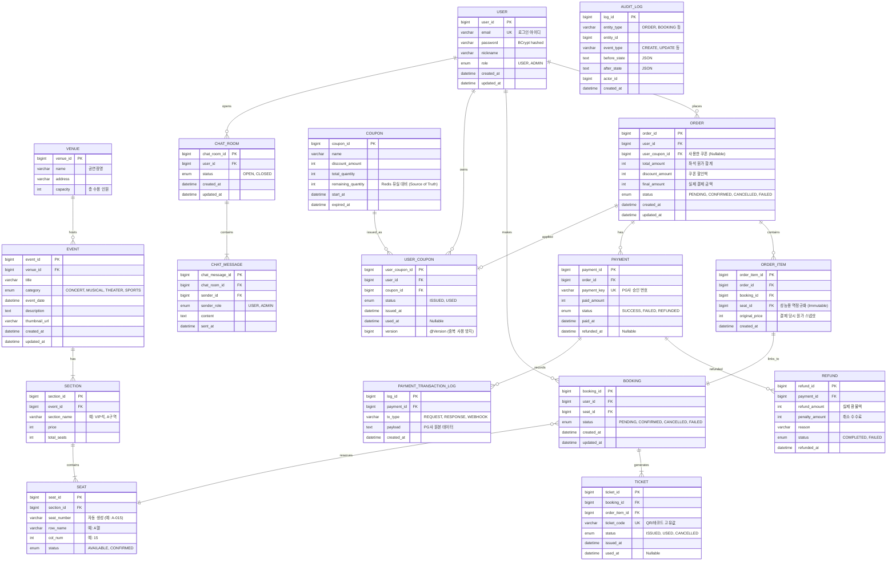

# 🗄️ ERD (Entity Relationship Diagram)

## 1. ERD 다이어그램



---

## 2. 테이블 설계 주요 결정 사항

### 2-1. ORDER / BOOKING / TICKET 3계층 분리 이유

| 테이블 | 역할 | 존재 이유 |
|--------|------|-----------|
| `ORDER` | 결제 단위 묶음 | 쿠폰 적용·총액 계산은 주문 단위로 처리. 다건 좌석 구매 시 하나의 ORDER로 묶음 |
| `BOOKING` | 좌석 단위 점유 | 개별 좌석의 선점(Hold) → 확정 상태를 추적. 좌석과 1:1 대응 |
| `TICKET` | 입장 자격 증명 | 결제 완료 후 발급. QR/바코드 코드 보유. 취소 시에도 이력 보존 |

> **왜 BOOKING과 TICKET을 분리하는가?**
> BOOKING은 "예매 행위"이고 TICKET은 "입장 권한"이다. 취소 후 재발급 같은 시나리오에서 BOOKING은 CANCELLED가 되더라도 TICKET 이력이 별도로 남아야 감사(Audit) 추적이 가능하다.

### 2-2. ORDER_ITEM.seat_id 역정규화 설계

`ORDER_ITEM`은 `BOOKING`을 통해 `SEAT`에 접근할 수 있지만, `seat_id`를 직접 보유한다.
이는 **성능용 역정규화**로, 주문 내역 조회 시 JOIN 뎁스를 줄이기 위함이다.
`seat_id`는 결제 완료 후 변경되지 않는 Immutable 값이므로 역정규화의 부작용이 없다.

### 2-3. SEAT.status 2단계 설계 (AVAILABLE / CONFIRMED)

DB의 SEAT 상태는 최종 확정 여부만 관리한다. **임시 선점(Hold) 상태는 Redis TTL로 관리**하여 DB 부하를 줄인다.

| 상태 | 의미 | 관리 주체 |
|------|------|-----------|
| `AVAILABLE` | 예매 가능 | MySQL |
| `CONFIRMED` | 예매 확정 | MySQL (결제 완료 시 전환) |
| Hold (임시 선점) | 결제 진행 중 (5분) | **Redis TTL** — `hold:seat:{seatId}` |

> Redis TTL 만료 시 Hold는 자동 해제되며 SEAT.status는 `AVAILABLE` 그대로 유지된다.
> 웹훅 수신 시 Hold 유효성을 검증한 후 `CONFIRMED`로 전환한다.

### 2-4. COUPON.remaining_quantity — Redis와 MySQL 이중 관리

선착순 쿠폰 발급 시 Redis에서 원자적으로 수량을 차감하지만, **Redis 데이터 유실(재시작 등)에 대비해 MySQL에도 `remaining_quantity`를 Source of Truth로 보관**한다.

| 저장소 | 역할 | 이유 |
|--------|------|------|
| Redis | 실시간 수량 차감 (DECR) | 원자적 연산, 동시성 처리 |
| MySQL `remaining_quantity` | 최종 수량 정합성 보장 | Redis 유실 시 복구 기준 |

### 2-5. USER_COUPON.version — 낙관적 락으로 중복 사용 방지

쿠폰 사용 시 `@Version` 필드를 활용한 낙관적 락을 적용한다.
쿠폰 발급(선착순)은 분산락으로, 쿠폰 **사용**(예매 확정 시)은 낙관적 락으로 이중 보호한다.

| 시점 | 제어 방식 | 이유 |
|------|-----------|------|
| 쿠폰 발급 | Redis 분산락 | 다수 동시 요청, 외부 서비스 포함한 전체 로직 보호 |
| 쿠폰 사용 | JPA `@Version` 낙관적 락 | 단일 쿠폰 사용은 충돌 빈도 낮음, DB 트랜잭션 범위 내 처리 충분 |

### 2-6. CHAT_MESSAGE → CHAT_ROOM 단방향 참조

양방향 연관관계 설정 시 `@OneToMany` 로딩으로 모든 메시지를 채팅방 조회 시 함께 불러오는 N+1 문제가 발생한다.
메시지는 항상 **커서 기반 페이징**으로 별도 조회하므로 단방향이 적합하다.

### 2-7. PAYMENT_TRANSACTION_LOG — Mock PG 웹훅 추적

Mock PG 연동 시 요청(REQUEST) / 응답(RESPONSE) / 웹훅(WEBHOOK) 각 단계의 원본 payload를 저장한다.
결제 이슈 발생 시 디버깅 근거로 활용하며, 실제 PG 연동 전환 시에도 동일 구조를 사용할 수 있다.

---

## 3. 인덱스 설계 (도전 기능 연계)

| 테이블 | 인덱스 대상 컬럼 | 타입 | 이유 |
|--------|----------------|------|------|
| EVENT | `(category, event_date)` | 복합 | 장르별 + 날짜 범위 검색 빈번 |
| EVENT | `title` | 단일 | LIKE 검색 대상 |
| SEAT | `(section_id, status)` | 복합 | 구역별 잔여 좌석 조회 |
| BOOKING | `user_id` | 단일 | 내 예매 내역 조회 |
| ORDER | `user_id` | 단일 | 내 주문 내역 조회 |
| USER_COUPON | `(coupon_id, user_id)` | 복합 UK | 중복 발급 방지 (UNIQUE 제약 겸용) |
| CHAT_MESSAGE | `(chat_room_id, chat_message_id DESC)` | 복합 | 커서 기반 최신 메시지 조회 |
| CHAT_ROOM | `(user_id, status)` | 복합 | 사용자별/상태별 문의 조회 |

---

## 4. 도메인 경계 정리

```
[User Context]
  └─ USER

[Catalog Context]
  └─ VENUE, EVENT, SECTION, SEAT

[Booking/Order Context]
  └─ ORDER, ORDER_ITEM, BOOKING, TICKET

[Payment Context]
  └─ PAYMENT, REFUND, PAYMENT_TRANSACTION_LOG

[Promotion Context]
  └─ COUPON, USER_COUPON

[CS Context]
  └─ CHAT_ROOM, CHAT_MESSAGE

[Audit Context]
  └─ AUDIT_LOG
```

각 컨텍스트는 다른 컨텍스트의 엔티티를 직접 참조하지 않고 **ID(FK)로만 참조**한다.
예: Booking Context에서 User 엔티티를 `@ManyToOne`으로 로딩하되, User 서비스를 직접 호출하지 않는다.

> **AUDIT_LOG는 모든 컨텍스트에서 독립적으로 기록**된다. 별도의 `AuditService`가 도메인 이벤트를 구독하거나, `@EntityListeners(AuditingEntityListener.class)`로 자동 기록한다.
